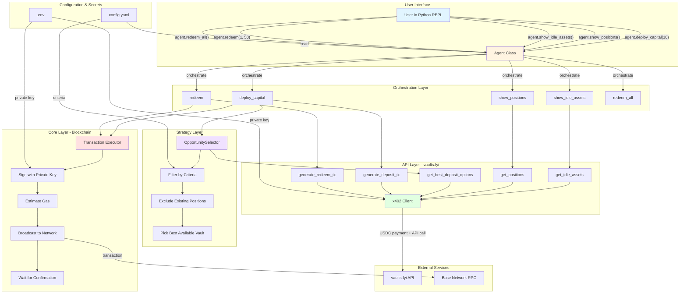
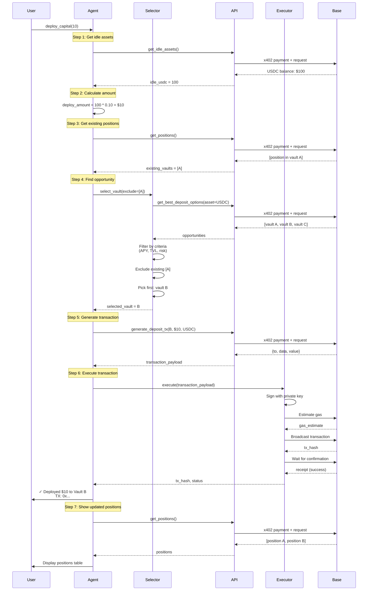
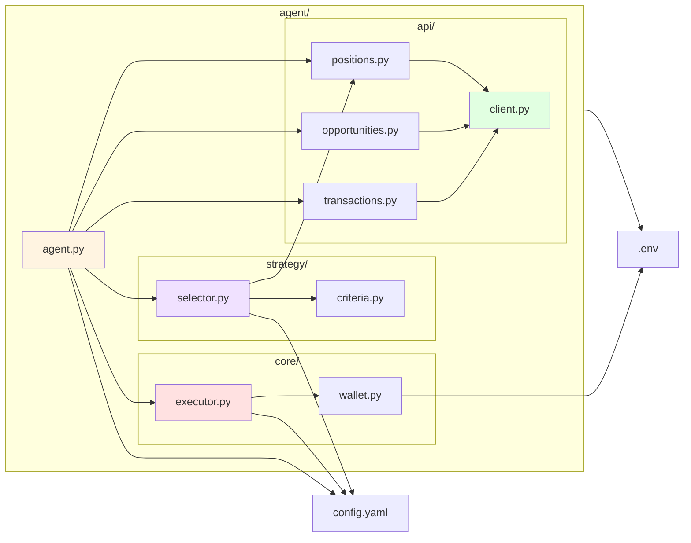
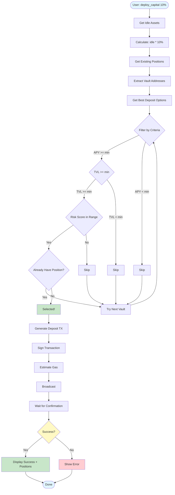
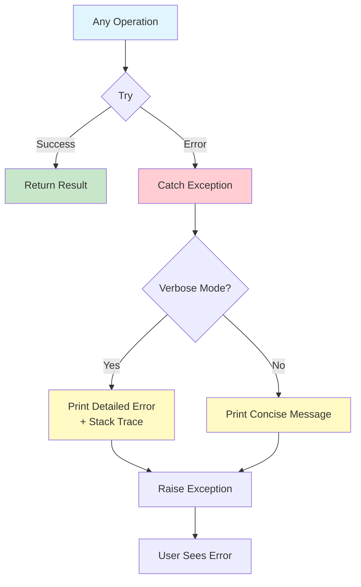

# DeFi Agent Architecture Diagram

## System Overview

```mermaid
graph TB
    subgraph "User Interface"
        USER[User in Python REPL]
        USER -->|"agent.deploy_capital(10)"| AGENT[Agent Class]
        USER -->|"agent.show_positions()"| AGENT
        USER -->|"agent.show_idle_assets()"| AGENT
        USER -->|"agent.redeem(1, 50)"| AGENT
        USER -->|"agent.redeem_all()"| AGENT
    end

    subgraph "Orchestration Layer"
        AGENT -->|orchestrate| DEPLOY[deploy_capital]
        AGENT -->|orchestrate| SHOW_POS[show_positions]
        AGENT -->|orchestrate| SHOW_IDLE[show_idle_assets]
        AGENT -->|orchestrate| REDEEM[redeem]
        AGENT -->|orchestrate| REDEEM_ALL[redeem_all]
    end

    subgraph "Strategy Layer"
        DEPLOY --> SELECTOR[OpportunitySelector]
        SELECTOR --> FILTER[Filter by Criteria]
        FILTER --> EXCLUDE[Exclude Existing Positions]
        EXCLUDE --> PICK[Pick Best Available Vault]
    end

    subgraph "API Layer - vaults.fyi"
        SHOW_IDLE --> API_IDLE[get_idle_assets]
        SHOW_POS --> API_POS[get_positions]
        SELECTOR --> API_OPP[get_best_deposit_options]
        DEPLOY --> API_TX_DEP[generate_deposit_tx]
        REDEEM --> API_TX_RED[generate_redeem_tx]

        API_IDLE --> X402[x402 Client]
        API_POS --> X402
        API_OPP --> X402
        API_TX_DEP --> X402
        API_TX_RED --> X402
    end

    subgraph "Core Layer - Blockchain"
        DEPLOY --> EXECUTOR[Transaction Executor]
        REDEEM --> EXECUTOR

        EXECUTOR --> SIGN[Sign with Private Key]
        SIGN --> GAS[Estimate Gas]
        GAS --> BROADCAST[Broadcast to Network]
        BROADCAST --> WAIT[Wait for Confirmation]
    end

    subgraph "Configuration & Secrets"
        CONFIG[config.yaml] -->|read| AGENT
        CONFIG -->|criteria| FILTER
        ENV[.env] -->|private key| SIGN
        ENV -->|private key| X402
    end

    subgraph "External Services"
        X402 -->|USDC payment + API call| VAULTS_API[vaults.fyi API]
        BROADCAST -->|transaction| BASE_RPC[Base Network RPC]
    end

    style USER fill:#e1f5ff
    style AGENT fill:#fff4e1
    style SELECTOR fill:#f0e1ff
    style X402 fill:#e1ffe1
    style EXECUTOR fill:#ffe1e1
```

## Deploy Capital Flow (Detailed)

```mermaid
sequenceDiagram
    participant User
    participant Agent
    participant Selector
    participant API
    participant Executor
    participant Base

    User->>Agent: deploy_capital(10)

    Note over Agent: Step 1: Get idle assets
    Agent->>API: get_idle_assets()
    API->>Base: x402 payment + request
    Base-->>API: USDC balance: $100
    API-->>Agent: idle_usdc = 100

    Note over Agent: Step 2: Calculate amount
    Agent->>Agent: deploy_amount = 100 * 0.10 = $10

    Note over Agent: Step 3: Get existing positions
    Agent->>API: get_positions()
    API->>Base: x402 payment + request
    Base-->>API: [position in vault A]
    API-->>Agent: existing_vaults = [A]

    Note over Agent: Step 4: Find opportunity
    Agent->>Selector: select_vault(exclude=[A])
    Selector->>API: get_best_deposit_options(asset=USDC)
    API->>Base: x402 payment + request
    Base-->>API: [vault A, vault B, vault C]
    API-->>Selector: opportunities

    Selector->>Selector: Filter by criteria<br/>(APY, TVL, risk)
    Selector->>Selector: Exclude existing [A]
    Selector->>Selector: Pick first: vault B
    Selector-->>Agent: selected_vault = B

    Note over Agent: Step 5: Generate transaction
    Agent->>API: generate_deposit_tx(B, $10, USDC)
    API->>Base: x402 payment + request
    Base-->>API: {to, data, value}
    API-->>Agent: transaction_payload

    Note over Agent: Step 6: Execute transaction
    Agent->>Executor: execute(transaction_payload)
    Executor->>Executor: Sign with private key
    Executor->>Base: Estimate gas
    Base-->>Executor: gas_estimate
    Executor->>Base: Broadcast transaction
    Base-->>Executor: tx_hash
    Executor->>Base: Wait for confirmation
    Base-->>Executor: receipt (success)
    Executor-->>Agent: tx_hash, status

    Agent->>User: ✓ Deployed $10 to Vault B<br/>TX: 0x...

    Note over Agent: Step 7: Show updated positions
    Agent->>API: get_positions()
    API->>Base: x402 payment + request
    Base-->>API: [position A, position B]
    API-->>Agent: positions
    Agent->>User: Display positions table
```

## Module Dependencies

```mermaid
graph LR
    subgraph "agent/"
        AGENT[agent.py]

        subgraph "api/"
            CLIENT[client.py]
            POS[positions.py]
            OPP[opportunities.py]
            TX[transactions.py]
        end

        subgraph "strategy/"
            SEL[selector.py]
            CRIT[criteria.py]
        end

        subgraph "core/"
            EXEC[executor.py]
            WALLET[wallet.py]
        end
    end

    CONFIG[config.yaml]
    ENV[.env]

    AGENT --> POS
    AGENT --> OPP
    AGENT --> TX
    AGENT --> SEL
    AGENT --> EXEC

    POS --> CLIENT
    OPP --> CLIENT
    TX --> CLIENT

    SEL --> CRIT
    SEL --> POS

    EXEC --> WALLET

    CLIENT --> ENV
    WALLET --> ENV

    AGENT --> CONFIG
    SEL --> CONFIG
    EXEC --> CONFIG

    style AGENT fill:#fff4e1
    style CLIENT fill:#e1ffe1
    style SEL fill:#f0e1ff
    style EXEC fill:#ffe1e1
```

## Data Flow: Deploy Capital

```mermaid
flowchart TD
    START([User: deploy_capital 10%]) --> GET_IDLE[Get Idle Assets]
    GET_IDLE --> CALC[Calculate: idle * 10%]
    CALC --> GET_POS[Get Existing Positions]
    GET_POS --> EXTRACT[Extract Vault Addresses]
    EXTRACT --> GET_OPP[Get Best Deposit Options]
    GET_OPP --> FILTER{Filter by Criteria}

    FILTER -->|APY >= min| FILTER2{TVL >= min}
    FILTER -->|APY < min| SKIP1[Skip]

    FILTER2 -->|TVL >= min| FILTER3{Risk Score in Range}
    FILTER2 -->|TVL < min| SKIP2[Skip]

    FILTER3 -->|Yes| CHECK_EXIST{Already Have Position?}
    FILTER3 -->|No| SKIP3[Skip]

    CHECK_EXIST -->|Yes| NEXT[Try Next Vault]
    CHECK_EXIST -->|No| FOUND[Selected!]

    NEXT --> FILTER

    FOUND --> GEN_TX[Generate Deposit TX]
    GEN_TX --> SIGN[Sign Transaction]
    SIGN --> EST_GAS[Estimate Gas]
    EST_GAS --> BROADCAST[Broadcast]
    BROADCAST --> WAIT[Wait for Confirmation]
    WAIT --> SUCCESS{Success?}

    SUCCESS -->|Yes| DISPLAY[Display Success + Positions]
    SUCCESS -->|No| ERROR[Show Error]

    DISPLAY --> END([Done])
    ERROR --> END

    SKIP1 --> NEXT
    SKIP2 --> NEXT
    SKIP3 --> NEXT

    style START fill:#e1f5ff
    style FOUND fill:#c8e6c9
    style SUCCESS fill:#fff9c4
    style DISPLAY fill:#c8e6c9
    style ERROR fill:#ffcdd2
    style END fill:#e1f5ff
```

## Error Handling Flow

```mermaid
flowchart TD
    OPERATION[Any Operation] --> TRY{Try}

    TRY -->|Success| RETURN[Return Result]
    TRY -->|Error| CATCH[Catch Exception]

    CATCH --> CHECK_VERBOSE{Verbose Mode?}

    CHECK_VERBOSE -->|Yes| DETAILED[Print Detailed Error<br/>+ Stack Trace]
    CHECK_VERBOSE -->|No| CONCISE[Print Concise Message]

    DETAILED --> RAISE[Raise Exception]
    CONCISE --> RAISE

    RAISE --> USER_SEES[User Sees Error]

    style OPERATION fill:#e1f5ff
    style RETURN fill:#c8e6c9
    style CATCH fill:#ffcdd2
    style DETAILED fill:#fff9c4
    style CONCISE fill:#fff9c4
```
